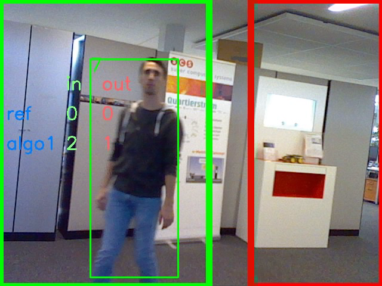

# PoC AFZ

Proof of Concept to count people going from one area to another.



## Getting Started
Create 

```bash
conda env create -f environment.yml
source activate afz
```

## Labeling
```bash
python main_labeler.py
```


## Pipeline
The pipeline consists of three main steps.

### Object Detection
Using https://pjreddie.com/darknet/yolo/

### Object Tracking
Using https://github.com/nwojke/deep_sort

We used the implementation of Yolov3 fr
https://github.com/Qidian213/deep_sort_yolov3

### Counting
Own implementation using a comparison between the area inside and outside.

## DataSet
The default training of Yolo is based on the [Coco Dataset](http://cocodataset.org/).
We also tried the [Crowd Human Dataset](http://www.crowdhuman.org/).
